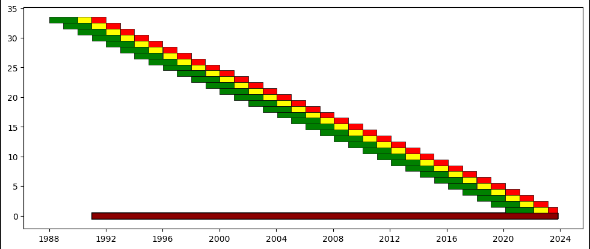

```{r setup, include=FALSE}
knitr::opts_chunk$set(echo = FALSE)
library(ggplot2) 
library(gridExtra)
library(knitr)
library('pacman')
library(kableExtra)
p_load(dplyr, forcats, knitr, kableExtra, tinytex, janitor)
```
\linespread{1.5}\selectfont
# Introduction

There are many complex machine learning algorithms that can be utilized for algorithmic trading but not always they may fulfill our requirements. Sometimes simple machine learning models can also do the work. Therefore, for this task I have create a Linear Regression with the hope that I will get some nice results. The financial insturment under consideration is S&P 500 (*^SPX*) during the period *1988-01-04* to *2023-10-07*. S&P 500 Closing Price for the period above can be visualized in the following way:

```{r fig1, fig.cap="S&P 500 CLosing Prices", fig.height=3, fig.width=9}
SnP <- read.csv('../Results/Main/df.csv')
df_SnP <- data.frame(Date = as.Date(SnP$Date), Value = SnP$Close)

plot_SnP <- ggplot() + geom_line(data = df_SnP, aes(x = Date, y = Value), color = 'black') + xlab('Year') + theme(axis.title.y = element_blank(), axis.title.x = element_blank())

plot_SnP
```

Walk Forward Optimization has been used, the Out-of-Sample (OOS) starts from *1992-01-02*. The Training Window ia 505 trading days and the Validation and Testing windows are 253 trading days each. The Walk Forward Windows looks like this:

```{r WFO, out.width="95%", out.height="60%",fig.align='center', fig.cap='Walk forward optimization scheme with 5-years IS and 1-year OOS.'}

```
\vspace{-0.5cm}\noindent\linespread{0.65}\selectfont {\scriptsize \textbf{Note}: \textit{The bars in green represent the training set, in yellow the validation set, in red the out-of-sample testing set, and the bars in the dark-red represent the total out-of-sample data. Training window is 505 trading days, validation and testing windows are 253 trading days each.}}

\linespread{1.5}\selectfont

\pagebreak

# Inputs Model and Strategy

As mentioned before, I have used Linear Regression to predict the next day closing price. The regression uses the following inputs to generate the predictions:

```{r df Input, results='axis'}
df_inputs <- data.frame(
  KEY = c("Open", "High", "Low", "Volume", "Close"),
  VALUE = c("Moving Average Convergence/Divergence (MACD)", "Realized Volatility (RV)", "Relative Strength Index (RSI)", "", "")
)

kable(df_inputs, "pipe", col.names = c("Price Inputs", "Techincal Indicators"), align = "c", padding = -3L)
```

Due to the fact that Linear Regression is a computationally very fast, I decided to use Grid Search for the hyperparameter tunning. For the base case scenario, we have 120 combinations of hyperparameters. We may also read in a way that we create 120 Linear Regressions and choose th ebest performing ones. You may find the range of hyperparameters here:

```{r df HPT, results='axis'}
df_HPT <- data.frame(
  KEY = c("Number of Lags", "Window of RSI", "Window of RV"),
  VALUE = c("[7,9,11,14,16,18,20,22]", "[7,14,21,27,33]", "[7,14,21]")
)

kable(df_HPT, "pipe", col.names = c("Hyperparameters", "Range"), align = "c", padding = -3L)
```

I use the *Long-Only* strategy for this Algorithmic Investment Strategy (*AIS*). If the Predicted Closing Price at *t+1* is higher than the Closing Price at *t*, we open a Long Position, otherwise we stay market neutral and not open any position.

$$
Long-Only: \begin{cases}  
Signal = 1 \space\space if \space\space P_{t+1} > P_{t} \\
 Signal = 0 \space\space if \space\space P_{t+1} < P_{t}
\end{cases} 
\tag{1}
$$

\pagebreak
# Empirical Results

Based on Figure 3 and Table 3, we see that the Linear Regression outperforms the Buy&Hold strategy with an $IR^{**}$ of **32.4**. This is quite a good results considering that we got them just from a Linear Regression. However, it is worth noticing that during the first 15 years, the Linear Regression did not perform well at all. It started to get better when S&P 500 was continuously increasing after the year 2009.  Since, this is the case, we may expect it to worsen when the trend of S&P 500 becomes non-linear in a long run.

```{r fig_1, fig.cap="The Long-Only Strategy on S&P 500", fig.width=10, fig.height=5, results='hide'}
#...... S&P 500 Long-Only ..........#


df_SnP_Strategy <- read.csv('../Results/Main/df_Equity_Curve.csv')
df_SnP_Strategy <- data.frame(Date = as.Date(df_SnP_Strategy$Date), Value = df_SnP_Strategy$strategy)

df_Benchmark_SnP <- read.csv('../Results/Main/df_Equity_Curve.csv')
df_Benchmark_SnP <- data.frame(Date = as.Date(df_Benchmark_SnP$Date), Value = df_Benchmark_SnP$buy_n_hold)


ec_base_model_SnP_LO <- ggplot() +
  geom_line(data = df_Benchmark_SnP, aes(x = Date, y = Value, color = "S&P 500")) +
  geom_line(data = df_SnP_Strategy, aes(x = Date, y = Value, color = "Linear Regression")) +
  scale_color_manual(values = c("darkorange", "darkblue" ), name='Strategy', limits=c("S&P 500", "Linear Regression")) + theme_bw() + theme(
    legend.position = c(.02, .98),
    legend.justification = c("left", "top"),
    legend.box.just = "left",
    legend.margin = margin(1, 1, 1, 1),
    legend.background = element_blank(),
    legend.box.background = element_rect(colour = "black"),
    legend.title = element_blank(), 
    legend.spacing.y = unit(0, "mm"), 
    ) + ylab('Equity')

ec_base_model_SnP_LO

```

\vspace{-0.5cm}\noindent\linespread{0.65}\selectfont {\scriptsize \textbf{Note}: \textit{S\&P 500 is the Buy\&Hold Strategy. The plot presents the equity curve for the Long-Only strategy. Trading starts on 1992-01-02. Daily frequency data has been used. Transaction cost is 0.05\%.}}

\linespread{1.5}\selectfont

\renewcommand{\arraystretch}{0.9}
\fontsize{8}{10}\selectfont
```{r perf_metric_SnP_LO, results='asis', fig.align='center'}

##### LONG-ONLY S&P500 #####
perf_metrics_base_model_L_O <- read.csv('../Performance Metrics/df_perf_metr_LO.csv')
perf_metrics_base_model_L_O[is.na(perf_metrics_base_model_L_O)] <- ""

# Create a Markdown table
kable(perf_metrics_base_model_L_O, format = "simple", col.names = c("" , "", "ARC(%)", "ASD(%)", "MD(%)", "MLD", "IR*(%)", "IR**(%)"), caption = 'Performance metrics for S&P 500')
```

\normalsize
\vspace{-0.5cm}\noindent\linespread{0.65}\selectfont {\scriptsize \textbf{Note}: \textit{S\&P 500 represents the benchmark Buy\&Hold Strategy. Trading starts on 1992-01-02. Transaction cost is 0.05\%. The best strategy is the one that holds the highest Modified Information Ratio ($IR^{**}$). Columns with the best corresponding values are denoted in bold.}}

\linespread{1.5}\selectfont

\pagebreak
# Sensitivity Analysis

In the sensitivity analysis, for each hyperparameter a higher range and a lower range is chosen. The choice is the following:

```{r df SA, results='axis'}
df_SA <- data.frame(
  KEY = c("Number of Lags", "Window of RSI", "Window of RV", "Transaction Cost"),
  VALUE = c("[1,3,5] & [24,26,28]", "[2,4,6] & [35,37,39]", "[2,4,5]", "0.01% & 0.1%")
)

kable(df_SA, "pipe", col.names = c("Hyperparameters", "Range"), align = "c", padding = -3L)
```

Figure 4 and Table 5, summarizes the equity curves and the performance metrics of the sensitivity analysis. With a higher transaction cost, the model exhibits poor performance. This is due to the fact that we take many trades and higher transaction cost give poor performance. Furthermore, if we decrease the number of lags, our model tends to behave poorly however increasing the number of lags gives similar performance as the Base Case. An increase in the RSI Window Length gives us better results, however a decrease in the length gives us the same results as increase. On the other hand, when we decrease the RV window length we obtain better results.

\pagebreak

```{r SENS LSTM, results='hide', fig.cap="LSTM Sensitivity Analysis for S&P 500", fig.width=10, fig.height=7}
#...... S&P 500 Long-Only ..........#

df_SnP_LSTM_1 <- read.csv('../Results/Main/df_Equity_Curve.csv')
df_SnP_LSTM_1 <- data.frame(Date = as.Date(df_SnP_LSTM_1$Date), Value = df_SnP_LSTM_1$strategy)

df_Benchmark_SnP <- read.csv('../Results/Main/df_Equity_Curve.csv')
df_Benchmark_SnP <- data.frame(Date = as.Date(df_Benchmark_SnP$Date), Value = df_Benchmark_SnP$buy_n_hold)

df_SnP_LSTM_SENS_1 <- read.csv('../Results/SENS_2_trans=0.01%/df_Equity_Curve.csv')
df_SnP_LSTM_SENS_1 <- data.frame(Date = as.Date(df_SnP_LSTM_SENS_1$Date), Value = df_SnP_LSTM_SENS_1$strategy)

df_SnP_LSTM_SENS_1A <- read.csv('../Results/SENS_1_trans=0.1%/df_Equity_Curve.csv')
df_SnP_LSTM_SENS_1A <- data.frame(Date = as.Date(df_SnP_LSTM_SENS_1A$Date), Value = df_SnP_LSTM_SENS_1A$strategy)

ec_base_model_SnP_LO_SENS_1 <- ggplot() +
  geom_line(data = df_Benchmark_SnP, aes(x = Date, y = Value, color = "S&P 500")) +
  geom_line(data = df_SnP_LSTM_1, aes(x = Date, y = Value, color = "Base Case")) +
  geom_line(data = df_SnP_LSTM_SENS_1, aes(x = Date, y = Value, color = "Transaction Cost = 0.01%")) +
  geom_line(data = df_SnP_LSTM_SENS_1A, aes(x = Date, y = Value, color = "Transaction Cost = 0.1%")) +
  scale_color_manual(values = c("darkorange", "darkblue", "darkgreen", "darkred"), name='Strategy', limits=c("S&P 500", "Base Case", "Transaction Cost = 0.01%", "Transaction Cost = 0.1%")) + theme_bw() + theme(
    legend.position = c(.02, .98),
    legend.justification = c("left", "top"),
    legend.box.just = "left",
    legend.margin = margin(1, 1, 1, 1),
    legend.background = element_blank(),
    legend.box.background = element_rect(colour = "black"),
    legend.title = element_blank(), 
    legend.spacing.y = unit(0, "mm"), 
  ) + ylab('Equity')


#...... S&P 500 Long-Only ..........#

df_SnP_LSTM_1 <- read.csv('../Results/Main/df_Equity_Curve.csv')
df_SnP_LSTM_1 <- data.frame(Date = as.Date(df_SnP_LSTM_1$Date), Value = df_SnP_LSTM_1$strategy)

df_Benchmark_SnP <- read.csv('../Results/Main/df_Equity_Curve.csv')
df_Benchmark_SnP <- data.frame(Date = as.Date(df_Benchmark_SnP$Date), Value = df_Benchmark_SnP$buy_n_hold)

df_SnP_LSTM_SENS_2 <- read.csv('../Results/SENS_3_nl=[1,3,5]/df_Equity_Curve.csv')
df_SnP_LSTM_SENS_2 <- data.frame(Date = as.Date(df_SnP_LSTM_SENS_2$Date), Value = df_SnP_LSTM_SENS_2$strategy)

df_SnP_LSTM_SENS_2A <- read.csv('../Results/SENS_4_nl=[24,26,28]/df_Equity_Curve.csv')
df_SnP_LSTM_SENS_2A <- data.frame(Date = as.Date(df_SnP_LSTM_SENS_2A$Date), Value = df_SnP_LSTM_SENS_2A$strategy)

ec_base_model_SnP_LO_SENS_2 <- ggplot() +
  geom_line(data = df_Benchmark_SnP, aes(x = Date, y = Value, color = "S&P 500")) +
  geom_line(data = df_SnP_LSTM_1, aes(x = Date, y = Value, color = "Base Case")) +
  geom_line(data = df_SnP_LSTM_SENS_2, aes(x = Date, y = Value, color = "Number of Lags = [1,3,5]")) +
  geom_line(data = df_SnP_LSTM_SENS_2A, aes(x = Date, y = Value, color = "Number of Lags = [24,26,28]")) +
  scale_color_manual(values = c("darkorange", "darkblue", "darkgreen", "darkred"), name='Strategy', limits=c("S&P 500", "Base Case", "Number of Lags = [1,3,5]", "Number of Lags = [24,26,28]")) + theme_bw() + theme(
    legend.position = c(.02, .98),
    legend.justification = c("left", "top"),
    legend.box.just = "left",
    legend.margin = margin(1, 1, 1, 1),
    legend.background = element_blank(),
    legend.box.background = element_rect(colour = "black"),
    legend.title = element_blank(), 
    legend.spacing.y = unit(0, "mm"), 
  ) + ylab('Equity')


#...... S&P 500 Long-Only ..........#

df_SnP_LSTM_1 <- read.csv('../Results/Main/df_Equity_Curve.csv')
df_SnP_LSTM_1 <- data.frame(Date = as.Date(df_SnP_LSTM_1$Date), Value = df_SnP_LSTM_1$strategy)

df_Benchmark_SnP <- read.csv('../Results/Main/df_Equity_Curve.csv')
df_Benchmark_SnP <- data.frame(Date = as.Date(df_Benchmark_SnP$Date), Value = df_Benchmark_SnP$buy_n_hold)

df_SnP_LSTM_SENS_3 <- read.csv('../Results/SENS_5_WRSI=[2,4,6]/df_Equity_Curve.csv')
df_SnP_LSTM_SENS_3 <- data.frame(Date = as.Date(df_SnP_LSTM_SENS_3$Date), Value = df_SnP_LSTM_SENS_3$strategy)

df_SnP_LSTM_SENS_3A <- read.csv('../Results/SENS_6_WRSI=[35,27,29]/df_Equity_Curve.csv')
df_SnP_LSTM_SENS_3A <- data.frame(Date = as.Date(df_SnP_LSTM_SENS_3A$Date), Value = df_SnP_LSTM_SENS_3A$strategy)

ec_base_model_SnP_LO_SENS_3 <- ggplot() +
  geom_line(data = df_Benchmark_SnP, aes(x = Date, y = Value, color = "S&P 500")) +
  geom_line(data = df_SnP_LSTM_1, aes(x = Date, y = Value, color = "Base Case")) +
  geom_line(data = df_SnP_LSTM_SENS_3, aes(x = Date, y = Value, color = "RSI Window Length = [2,4,6]")) +
  geom_line(data = df_SnP_LSTM_SENS_3A, aes(x = Date, y = Value, color = "RSI Window Length = [25,27,29]")) +
  scale_color_manual(values = c("darkorange", "darkblue", "darkgreen", "darkred"), name='Strategy', limits=c("S&P 500", "Base Case", "RSI Window Length = [2,4,6]", "RSI Window Length = [25,27,29]")) + theme_bw() + theme(
    legend.position = c(.02, .98),
    legend.justification = c("left", "top"),
    legend.box.just = "left",
    legend.margin = margin(1, 1, 1, 1),
    legend.background = element_blank(),
    legend.box.background = element_rect(colour = "black"),
    legend.title = element_blank(), 
    legend.spacing.y = unit(0, "mm"), 
  ) + ylab('Equity')

#...... S&P 500 Long-Only ..........#

df_SnP_LSTM_1 <- read.csv('../Results/Main/df_Equity_Curve.csv')
df_SnP_LSTM_1 <- data.frame(Date = as.Date(df_SnP_LSTM_1$Date), Value = df_SnP_LSTM_1$strategy)

df_Benchmark_SnP <- read.csv('../Results/Main/df_Equity_Curve.csv')
df_Benchmark_SnP <- data.frame(Date = as.Date(df_Benchmark_SnP$Date), Value = df_Benchmark_SnP$buy_n_hold)

df_SnP_LSTM_SENS_4 <- read.csv('../Results/SENS_7_WRV=[2,4,5]/df_Equity_Curve.csv')
df_SnP_LSTM_SENS_4 <- data.frame(Date = as.Date(df_SnP_LSTM_SENS_4$Date), Value = df_SnP_LSTM_SENS_4$strategy)

ec_base_model_SnP_LO_SENS_4 <- ggplot() +
  geom_line(data = df_Benchmark_SnP, aes(x = Date, y = Value, color = "S&P 500")) +
  geom_line(data = df_SnP_LSTM_1, aes(x = Date, y = Value, color = "Base Case")) +
  geom_line(data = df_SnP_LSTM_SENS_4, aes(x = Date, y = Value, color = "RV Window Length = [2,4,5]")) +
  scale_color_manual(values = c("darkorange", "darkblue", "darkgreen", "darkred"), name='Strategy', limits=c("S&P 500", "Base Case", "RV Window Length = [2,4,5]", "RV Window Length = [23,25,27]")) + theme_bw() + theme(
    legend.position = c(.02, .98),
    legend.justification = c("left", "top"),
    legend.box.just = "left",
    legend.margin = margin(1, 1, 1, 1),
    legend.background = element_blank(),
    legend.box.background = element_rect(colour = "black"),
    legend.title = element_blank(), 
    legend.spacing.y = unit(0, "mm"), 
  ) + ylab('Equity')


ec_base_model_SnP_LO_SENS_1 <- ec_base_model_SnP_LO_SENS_1 + theme(axis.title.x = element_blank(),
                                                                   axis.title.y = element_blank())

ec_base_model_SnP_LO_SENS_2 <- ec_base_model_SnP_LO_SENS_2 + theme(axis.title.x = element_blank(),
                                                                   axis.title.y = element_blank())

ec_base_model_SnP_LO_SENS_3 <- ec_base_model_SnP_LO_SENS_3 + theme(axis.title.x = element_blank(),
                                                                   axis.title.y = element_blank())

ec_base_model_SnP_LO_SENS_4 <- ec_base_model_SnP_LO_SENS_4 + theme(axis.title.x = element_blank(),
                                                                   axis.title.y = element_blank())


grid.arrange(ec_base_model_SnP_LO_SENS_1, ec_base_model_SnP_LO_SENS_2, ec_base_model_SnP_LO_SENS_3, ec_base_model_SnP_LO_SENS_4, ncol=2)
```

\renewcommand{\arraystretch}{0.8}
\fontsize{8}{10}\selectfont
```{r SENS_perf_metric__LO_LS for all indices, results='asis'}
##### LONG-ONLY S&P500 #####
perf_metrics_base_model_L_O_SnP <- read.csv('../Performance Metrics/df_perf_metr_LO_LSTM.csv')
perf_metrics_base_model_L_O_SnP[is.na(perf_metrics_base_model_L_O_SnP)] <- ""

# Create a Markdown table
kable(perf_metrics_base_model_L_O_SnP, format = "simple", col.names = c("" , "", "ARC(%)", "ASD(%)", "MD(%)", "MLD", "IR*", "IR**"), caption = 'Sensitivity Analysis performance metrics', align = 'c')
```
